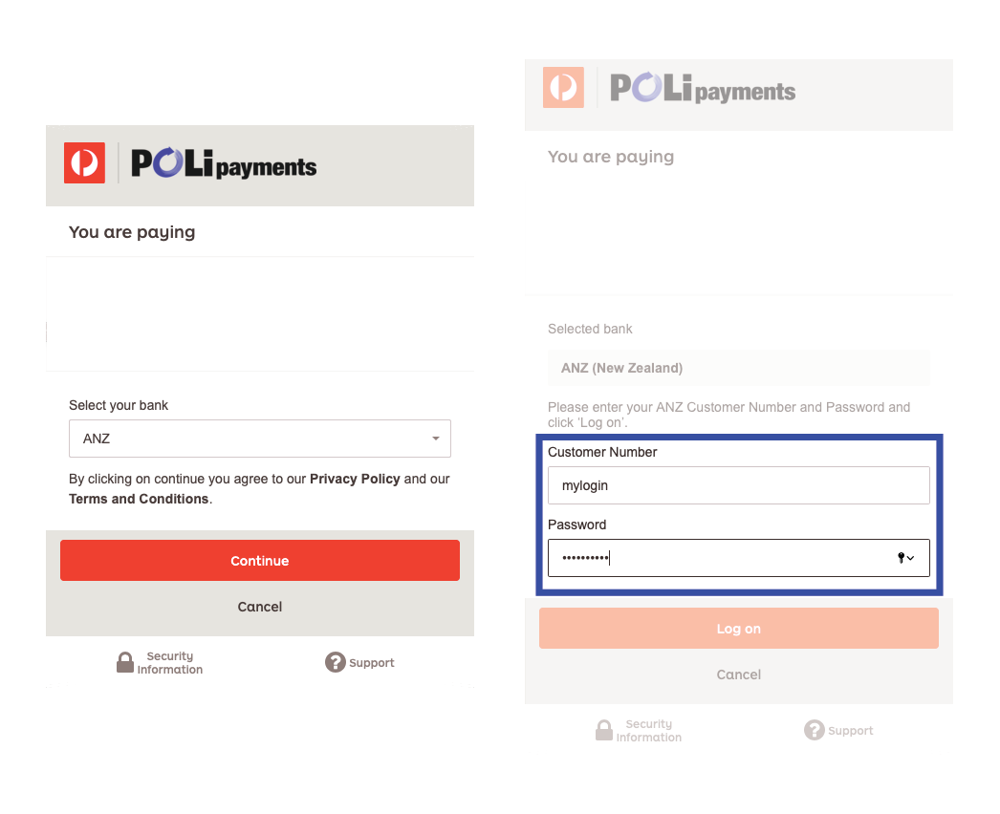
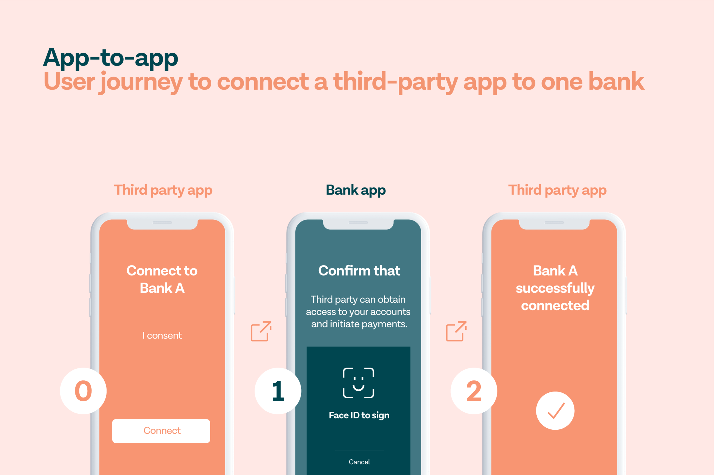
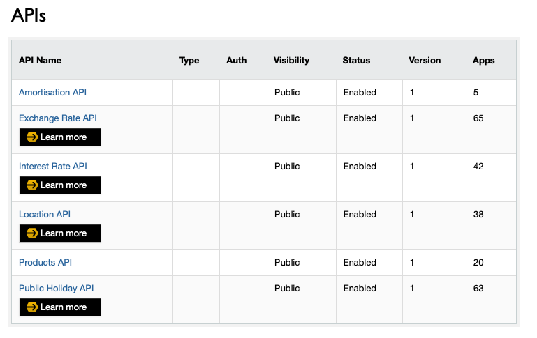

With open banking implemented and available in the UK, Europe, and Australia,  New Zealand still seems a few years away before open banking is accessible to the resource poor startups. Let's start by defining what open banking is.

## What is Open Banking

Putting it simply, open banking is an initiative which allows third party apps to access users banking data without users surrendering their bank logins (with the users' permission, of course). To illustrate, if you have used POLi Payments, you will no doubt have come across these screens:

This is how POLi payment is currently asking for the users banks credentials to initiate a bank transfer payment.

With open banking, users are instead redirected to the bank's authorisation flow, where they can allow an app restricted access to their account. It'll look more like the following:

More than 50 countries already have some form of Open API in place [^1], with UK and EU at the forefront of Open Banking. 

## Open Banking in NZ

Unlike the EU and Australia, banks in New Zealand are not forced to participate in Open Banking (PSD2 in EU and CDR in AU). Instead, Open Banking is voluntarily facilitated by Payments NZ, a governance organisation owned by the major banks in NZ (ANZ - 26.79%, Westpac - 22.97%, BNZ - 19.40%, ASB - 19.11%, Kiwibank - 4.79%, TSB - 2.60%, HSBC - 2.20%, and Citibank - 2.19%).

A company looking to offer a service has to perform these steps in order to utilise Open Banking:

1. Apply and register with Payments NZ and pay an undisclosed annual fee [^2]
2. Negotiate a bilateral contract agreement with the individual banks (to make agreements around how risk/liability and costs are shared)

As of May 2020, the APIs being offered by the banks have no real practical use. User's data are still not made available. See the following for ASB's APIs:

## Screen Scraping - The Only Viable Option

Without a timeline being enforced on the banks to implement Open Banking, it could be years before it is fully implemented and made available for use. As Payments NZ CEO Steve Wiggin has said, "there are no guarantees banks will adopt the API once it's approved" [^3].

Needless to say, screen scraping is not ideal since users are giving up total and complete access to their internet banking account to third party apps. 

What other options do developers have?

[^1]: [https://thepaypers.com/reports/the-open-banking-report-2019-insights-into-the-global-open-banking-landscape-2/r780814](https://thepaypers.com/reports/the-open-banking-report-2019-insights-into-the-global-open-banking-landscape-2/r780814)

[^2]: [https://www.interest.co.nz/personal-finance/98425/payments-nz-releases-standards-detailing-how-banks-and-fintechs-engage-open](https://www.interest.co.nz/personal-finance/98425/payments-nz-releases-standards-detailing-how-banks-and-fintechs-engage-open)

[^3]: [https://www.interest.co.nz/personal-finance/91777/payments-nz-ceo-steve-wiggins-how-those-payments-industry-are-kicking-gear](https://www.interest.co.nz/personal-finance/91777/payments-nz-ceo-steve-wiggins-how-those-payments-industry-are-kicking-gear)
