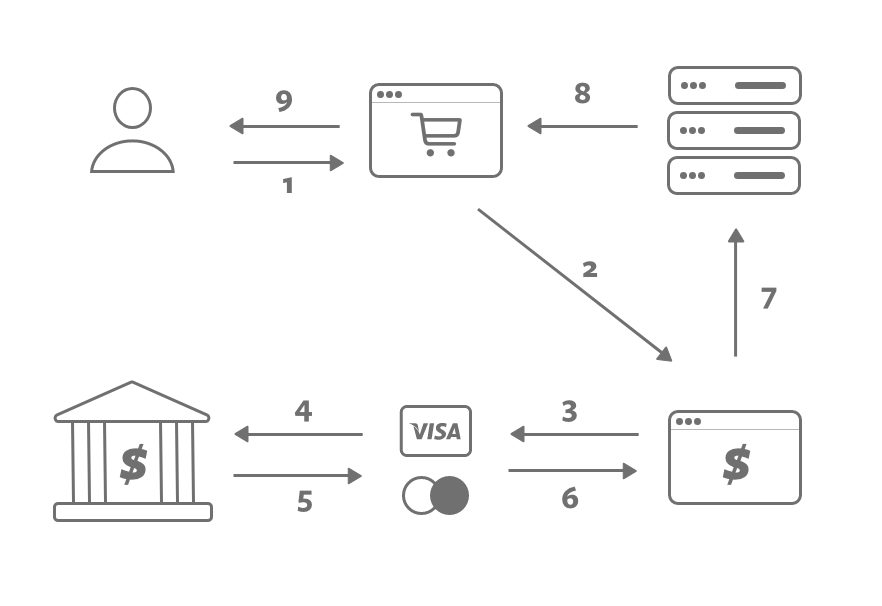

These days there are multiple ways to accept payments online. There are a variety of payment providers which differ in fee structure, popularity and ease of integration into your application., from the established incumbent, Paypal, to the novel and nascent "buy now, pay later" model like Afterpay. In this post we'll expore the different types of payment providers.

## Payment Gateway

First off, there's the traditional payment gateways that handle card payments online. Providers that fall into this category include internationally well known companies like Stripe, Paypal, and Adyen. Locally, there's Windmark (previously Payment Express).

These providers handle the processing and validation of your users' card information, completely bypassing your servers. Without ever seeing your users' card information, these provides have taken a significant burden off your back, namely, complying to the Payment Card Industry Data Security Standards (PCI DSS).

The fee you'll be looking at starts at 2.90% + $0.30 per transaction, and decreases (very modestly, and the fixed $0.30 doesn't decrease) with increasing total transaction amount per month. This transaction fee is split between multiple parties that are involved when your users make a payment with their card. The diagram demonstrates the simplified payment process:

Payment flow: 
1. A user fills out their credit card information and clicks submit
2. The payment information is sent to the payment gateway
3. The payment gateway then forwards the information to the card scheme (Visa or Mastercard)
4. The card scheme then passes the information to the bank that issued the user's credit card, which approves or rejects the transaction
5. The result is passed back to the card scheme
6. The result is forwarded to the payment gateway
7. The result is passed back to your server
8. You present the result on your application
9. The user receives the result

The fee is split into the interchange fee (paid to the bank that issued the user's credit card), the scheme fee (paid to Visa / Mastercard) and the processing fee (paid to the payment gateway). Interchange fees have a complex pricing structure, and is highly controversial, so we won't go into it in this post.

## Bank Transfer

Another type of online payment involves the users paying directly via their bank accounts. In the United States there's ACH, in the UK there's Faster Payment. In Australia and New Zealand, there are two services which allow users to pay via their bank accounts, PoliPay and Windcave's Account2Account.

[Due to open banking not yet fully implemented](/openBanking),  both PoliPay and Account2Account utilise screen scraping technology to implement the bank transfer functionality, which require the users to enter their bank credentials in order to complete the payment.

With many years of operation under their belt and allegedly haven't had any security breaches or losses suffered by any customer caused directly, users are still highly distrustful of these providers. The banks do not help the cause with open statements like these:

> "We have never endorsed the Poli or Account2Account service, as we are unable to audit their security" - ASB's FAQ

Although if your website list high ticket items where the card processing fee goes into two or three figures, users may be inclined to pay via bank transfer if the savings are passed directly to them. Examples of companies with high priced products that use these providers include Air New Zealand, JetStar and Etihad Airways.

## Buy now, pay later

Lastly, there's the "buy now, pay later" genre of payment providers, represented by companies like Afterpay and Zip.

These providers allow your users to make payments over instalments without interest, while you get paid the full amount upfront. They build upon credit card processors, and subsequently charge a higher fee. A commission of 4-6% + $0.30 per transaction is charges by Afterpay, while Zip provides a cheaper alternative of 2-4% + $0.30 per transaction.

## Summary

In this post we have looked at the different types of online payment providers and the fees they charge. In future posts we'll go deeper into payment gateways, card schemes and bank transfer payments.